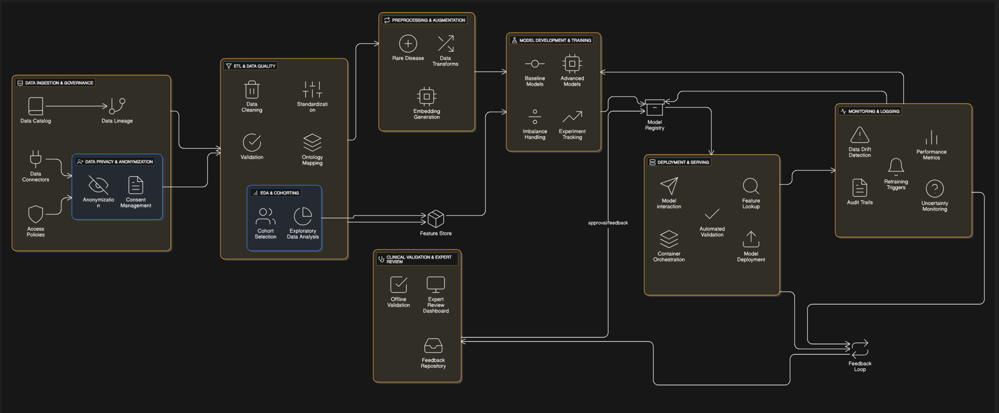

# Descripción de pipeline ML propuesta para diagnóstico de enfermedades (comunes y huérfanas)

Se propone un pipeline práctico, modular para predecir a partir de síntomas y datos clínicos la probabilidad de que un paciente padezca una enfermedad. El diseño contempla dos retos claves: **clases con muchos datos (comunes)** y **clases con muy pocos ejemplos (huérfanas)**.

---
# Fases:

## 1. Conceptualización del problema

Construir una solución que, dada una entrada clínica (síntomas, signos, pruebas, demográficos), entregue una predicción probabilística para una o varias enfermedades. Debe:

* Mantener alta sensibilidad en enfermedades críticas (bajo falso negativo).
* Manejar la escasez de datos para enfermedades huérfanas.
* Ser explicable y apta para validación clínica y despliegue seguro.

---

# 2. Diseño 

**Restricciones / limitaciones**

* Privacidad y regulación (p. ej. consentimiento del paciente, regulaciones locales).
* Datos ruidosos, faltantes, heterogéneos entre instituciones.
* Desbalance extremo entre clases (algunas enfermedades <100 ejemplos).
* Necesidad de interpretabilidad clínica con un experto (doctor).
* Predicción en tiempo real o near-real-time según caso de uso.

**Tipos de datos**

* Estructurados: edad, sexo, signos vitales, resultados de laboratorio (numéricos), códigos ICD, historial médico.
* No estructurados: notas clínicas, informes de imagen (texto libre, imágenes).
* Señales temporales: series de signos vitales, registros longitudinales.
* Etiquetas: diagnóstico confirmado (puede ser multi-label si hay comorbilidades).
---

 **Arquitectura general del pipeline (componentes)**

1. **Ingesta y catalogación**: conectores a EHR, CSVs, APIs de laboratorio, sistemas de imágenes.
2. **Anonimización**: desidentificación / pseudonimización y registro de consentimiento.
3. **ETL y calidad**: limpieza, unificación de unidades, imputación, validación de esquema.
4. **Feature store**: almacenamiento de features reproducibles (Feast u otro).
5. **Exploratory Data Analysis (EDA)** y generación de cohortes.
6. **Preprocesamiento** (incluye técnicas específicas para rarezas).
7. **Entrenamiento**: pipelines reproducibles (CI para modelos), experiment tracking (MLflow).
8. **Validación clínica**: pruebas offline + revisión por expertos.
9. **Registro de modelos** (model registry).
10. **Servir / Deploy**: model serving (TF-Serving, TorchServe, Seldon, FastAPI + Kubernetes).
11. **Monitoreo**: desempeño, drift (datos y concepto), cobertura, métricas clínicas.
12. **Retraining / MLOps**: workflows automatizados o semi-automáticos para reentrenar y promover versiones.

---

## 3. Desarrollo — detalle por etapa

 ### **Ingesta y gobernanza de datos**

* Registrar orígenes (EHR, hospitales, bases públicas, estudios clínicos).
* Políticas de acceso, contratos, y transformación legal (Data Processing Agreements).
* Mantener dataset lineage (fecha, versión, transformaciones).

### **Limpieza y normalización**

* Estandarizar unidades, ontologías (SNOMED, ICD), normalizar texto (NLP).
* Manejo de missing: imputación por variable (simple → median, o modelos dedicados).
* Detectar outliers clínicos con reglas médicas y validaciones.

### **Ingeniería de features**

* Variables demográficas, binarios de síntomas, conteos (frecuencia de episodios), features temporales (window summaries).
* Features textuales: embeddings clínicos (BioBERT/ClinicalBERT para notas).
* Features de imagen: transfer learning desde modelos preentrenados en dominios médicos.
* Agregar features de confianza/metadata (calidad, fuente).

### **Modelos candidatos**

* Baselines: Logistic Regression (with class weights), XGBoost/LightGBM.
* Deep learning: MLPs para tabular, RNN/Transformer para series y texto, CNNs para imágenes.
* Enfoques híbridos: redes que combinan embeddings de texto + features tabulares.
* Modelos probabilísticos: Gaussian Processes o Bayesian NN para incertidumbre.
* Métodos específicos para imbalance: focal loss, class weighting, threshold tuning.

### **Validación / testing**

* **Conjuntos**: train / val / test separados por paciente, idealmente por institución/time split.
* **Cross-validation**: estratificar por enfermedad o grupos, *nested CV* para selección de hiperparámetros.
* **Métricas**:

  * Para enfermedades comunes: AUC-ROC, AUC-PR, sensibilidad (recall), especificidad, F1.
  * Para enfermedades raras: AUC-PR y sensibilidad, además métricas calibración (Brier score), y tasas de falsos negativos críticos.
  * Medidas clínicas: PPV (valor predictivo positivo), NPV, número necesario para examen.
* **Evaluaciones adicionales**: curva de decisión clínica, análisis por subgrupos (edad, sexo, institución).
* **Robustez**: pruebas de adversarial noise, imputaciones fallidas.
* **Evaluación humana**: revisión por clínicos de casos límite; validación prospectiva en cohorte pequeña.

---

# 4. Producción — despliegue y operación

### **Despliegue**

* **Arquitectura recomendada**:

  * Contenedores Docker + Kubernetes para escalabilidad.
  * Model server con API REST.
  * Feature store para consistencia entre entrenamiento y servicio.
  * Pipeline orquestado con Airflow for retraining and ETL.
  * Model registry (MLflow, DVC) + CI/CD para modelos (tests automáticos).

### **Despliegue CI/CD:**

* Despliegue del contenedor en el servicio de cloud (AWS, AZURE, GOOGLE CLOUD) o servidor de la clinica requerido.
* Entrega del servicio del modelo predictivo  

### **Monitoreo**

* **Monitoreo de datos**:

  * Data drift en features y distribuciones.
  * Missingness tracking.
* **Monitoreo de performance**:

  * Métricas en línea: tasa de error, sensibilidad, AUC estimada en muestras etiquetadas de validación continua.
* **Monitoreo clínico**:

  * Tracking de alertas críticas (p. ej. incremento de falsos negativos).
* **Monitoreo de incertidumbre**:

  * Propagar y monitorizar la incertidumbre estimada (p. ej. proporción de predicciones con alta incertidumbre).
* **Alerta y rollback**:

  * Procesos para degradar a modelo anterior/manual o indicar “consultar especialista”.
* **Logging y trazabilidad**:

  * Audit logs, inputs y outputs, versión exacta del modelo.

### **Retraining**

* **Triggers para retraining**:

  * Caída de métricas por X%; drift estadístico; disponibilidad de nuevos casos etiquetados.
* **Estrategia**:

  * Retraining automático con validación humana semi-automática para Enfermedades huérfanas (human-in-the-loop).
  * Mantener dataset incremental y políticas de retención/refresh.
 

---

